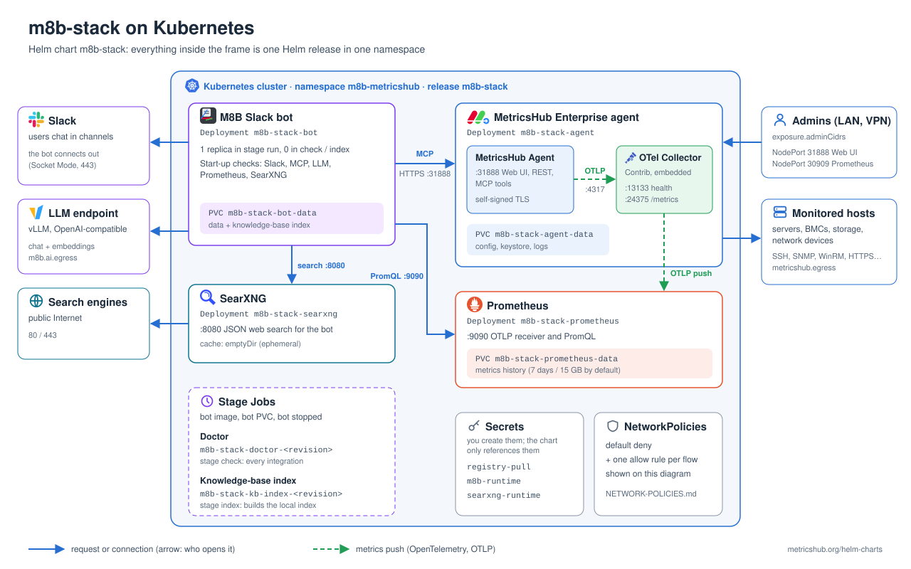

# M8B Stack Helm chart

[](https://github.com/MetricsHub/helm-charts/releases?q=m8b-stack) [](CHANGELOG.md)

MetricsHub Enterprise Agent (with its embedded OpenTelemetry Collector), Prometheus, SearXNG and the M8B Slack bot.
Readable YAML templates, configurable resources, retained PVCs, staged diagnostics and local KB indexing.

```bash
helm repo add metricshub https://metricshub.github.io/helm-charts
helm repo update
helm show values metricshub/m8b-stack > values-reference.yaml
# or, without a repository: oci://ghcr.io/metricshub/charts/m8b-stack
```

## Architecture

<p align="center"></p>


- The agent pushes metrics to the collector running in the **same container**, over loopback without TLS:
  nothing outside the Pod can reach port 4317, and the Pod keeps its real hostname.
- The bundled collector config (`files/config/otel-config.yaml`) exports to the in-cluster Prometheus and exposes a
  Prometheus scrape endpoint on 24375. Replace it entirely with `metricshub.otel.configText` to add exporters
  (Datadog, New Relic, BMC Helix, remote write...), starting from the
  [official example](https://metricshub.com/docs/latest/resources/config/otel/otel-config-example.yaml).
- Prometheus promotes OTLP resource attributes (`host.name`, ...) to labels, so PromQL can filter on them.

## Related documentation

The chart deploys and wires the components; their own documentation covers what they do and how to configure them.

**MetricsHub Agent**

- [MetricsHub documentation](https://metricshub.com/docs/latest/): concepts, connectors, metrics.
- [Installing on Docker, Enterprise edition](https://metricshub.com/docs/latest/installation/installing-on-docker?edition=enterprise):
  the same image as this chart, with its ports (31888, 13133, 24375), paths and embedded collector.
- [Resource settings](https://metricshub.com/docs/latest/configuration/resource-settings): what to put in
  `metricshub.yaml` (`metricshub.config.text` or `metricshub.config.existingSecret`) to monitor your hosts.

**M8B Slack bot**

- [M8B Slack Bot](https://metricshub.org/m8b-slack/): overview and
  [how to create the Slack app](https://metricshub.org/m8b-slack/#1-create-the-slack-app) (bot and app-level tokens).
- [Configuration reference](https://metricshub.org/m8b-slack/CONFIGURATION.html): every environment variable.
  Variables the chart manages (endpoints, models, data and knowledge-base settings) have their own value under
  `m8b`; set the others, such as the media store, through `m8b.extraConfig` (non-secret) or `m8b.extraEnv`
  (`secretKeyRef`). The chart rejects a managed variable in `m8b.extraConfig`.
- [AI backends](https://metricshub.org/m8b-slack/BACKENDS.html): which LLM backends work, what they must provide,
  reference models.

## Prerequisites

- A NetworkPolicy-enforcing CNI (policies are on by default), IPv4 Linux nodes, a StorageClass (or prepared
  local/existing volumes) and outbound access to Slack and your LLM endpoints.
- Credentials for the **private registry `docker.metricshub.com`** (see below). Both the MetricsHub Enterprise
  image and the M8B bot image are pulled from it. A public chart does not make these images public.
- A Slack app ([how to create it](https://metricshub.org/m8b-slack/#1-create-the-slack-app)) and an LLM chat endpoint
  ([supported backends](https://metricshub.org/m8b-slack/BACKENDS.html)); an embedding endpoint for the KB.

## Private registry access (docker.metricshub.com)

1. **Get credentials.** MetricsHub Enterprise customers receive a registry username and password in their
   onboarding email. Otherwise request access through [support.metricshub.com](https://support.metricshub.com)
   or [metricshub.com/pricing](https://metricshub.com/pricing).
2. **Check them** from a workstation (optional but saves a failed rollout):

   ```bash
   docker login docker.metricshub.com
   docker pull docker.metricshub.com/metricshub-enterprise:3.9.07
   docker pull docker.metricshub.com/metricshub/m8b-slack:3.1.0
   ```

3. **Give them to Kubernetes**: [GETTING-STARTED.md](GETTING-STARTED.md) step 4 writes them without echoing the
   password, step 5 creates the `registry-pull` Secret that every Pod of the chart references, and step 5b checks
   from the cluster that both images can be pulled. Do not reuse `~/.docker/config.json`: with a credential helper
   it holds no usable `auth` entry.

## Values

Copy `examples/portable.yaml` (CSI storage) or `examples/lab-values-example.yaml` (on-premises lab with local
volumes, used by [GETTING-STARTED.md](GETTING-STARTED.md)) to a private site file and REPLACE its example values: Slack workspace,
chat/embedding model IDs and endpoints, cluster CIDRs, monitored networks and StorageClass. Do not put Secret
values in YAML. Maps merge, lists replace, and later `-f` overrides earlier files. `values.schema.json` rejects
unknown keys and the chart rejects incompatible combinations.

```bash
helm pull metricshub/m8b-stack --untar
cp -n m8b-stack/examples/portable.yaml my-values.yaml   # edit every REPLACE marker
# Offline render only; nothing is applied.
helm template demo metricshub/m8b-stack --namespace demo -f my-values.yaml --set stage=run > rendered.yaml
```

Resource names follow Helm conventions: `<release>-m8b-stack-<component>` (just `<release>-<component>` when the
release name already contains `m8b-stack`); override with `nameOverride` / `fullnameOverride`. Several releases can
share a namespace. Renaming a release creates new PVCs: do not rename an installed one.

### What the agent can reach

With network policies on, the agent Pod only reaches DNS, Prometheus and the destinations listed in
`metricshub.egress`. **An empty list means nothing is monitored.** The same list governs the embedded collector's
exporters (for a SaaS over the Internet: `0.0.0.0/0` minus private ranges, port 443). See `examples/portable.yaml`.

Set `network.podCidrs` and `network.serviceCidrs` to the real cluster ranges. They are then excluded from public
egress, and any `metricshub.egress` rule that overlaps them is **rejected at render time**, unless an `except`
entry covers the cluster range or `network.allowClusterCIDROverlap: true` records that the overlap was reviewed.

To scrape the collector (24375) or probe its health (13133) from outside the Pod, list the trusted source CIDRs in
`metricshub.otel.ingressCidrs`. The ClusterIP Service `<fullname>-agent` exposes both ports.

### MCP TLS

The agent serves its Web UI, REST API and MCP endpoint on 31888 with its own **self-signed certificate**, so the
bot must accept it: `m8b.allowSelfSignedMcp` defaults to `true`. This traffic never leaves the cluster and is
limited by network policies. Set it to `false` only after installing a certificate trusted by the bot in the
agent keystore (`/opt/metricshub/lib/security`, on the agent PVC).

## Secrets: supplied by the operator, never printed by the chart

| Default name             | Required content                                                                                         |
| ------------------------ | -------------------------------------------------------------------------------------------------------- |
| `registry-pull`          | dockerconfigjson for `docker.metricshub.com` (see above)                                                 |
| `m8b-runtime`            | `SLACK_BOT_TOKEN`, `SLACK_APP_TOKEN`, `AI_API_KEY`; `MCP_AGENT_TOKEN` generated by this agent (step 8)  |
| `m8b-runtime` (optional) | `AI_EMBEDDING_API_KEY` if the embedding endpoint uses a different key                                    |
| `searxng-runtime`        | `SEARXNG_SECRET` when SearXNG is enabled                                                                 |

Names are configurable under `secrets`. Use a Secret manager, an encrypted deployment workflow or secure local
tooling. Do not commit actual Secrets, .env files, kubeconfigs, rendered private values or registry credentials.

## Install

Follow **[GETTING-STARTED.md](GETTING-STARTED.md)**: installing Helm, discovering your cluster settings, values,
Secrets, volumes, then the staged install. In short, a `helm upgrade` applies ONLY the selected `stage`:

| Stage   | Runs                                  | Before moving on                                            |
| ------- | ------------------------------------- | ----------------------------------------------------------- |
| `core`  | agent, Prometheus, SearXNG            | create the MetricsHub API key in `m8b-runtime:MCP_AGENT_TOKEN` |
| `check` | Doctor Job (bot stopped)              | Doctor logs show success                                    |
| `run`   | the bot                               | a real Slack conversation works                             |
| `index` | KB index Job (bot stopped beforehand) | Job succeeded; delete it, then `run` again                  |

There is no hook or operator: each step is an explicit command, so the bot never shares its PVC with a Job.
Doctor and index Jobs carry the Helm revision in their name, so a stage can be re-run without an immutable-Job
error; Helm does not remove a Job from a failed revision, so delete it before retrying.
`helm uninstall` keeps PVCs, PVs and Secrets; deleting data is a separate, deliberate action.

## Validation

Network isolation uses standard NetworkPolicies by default, so Cilium is not required. On a Cilium cluster
you may opt into CiliumNetworkPolicies with `network.provider: cilium`; see [NETWORK-POLICIES.md](NETWORK-POLICIES.md). CI runs `scripts/test.sh` (lint, render matrix, rejected values) on
every change. That is offline only: on a representative cluster, test allowed AND denied traffic, DNS, storage,
Doctor, KB indexing and a real Slack retrieval before declaring production readiness.
